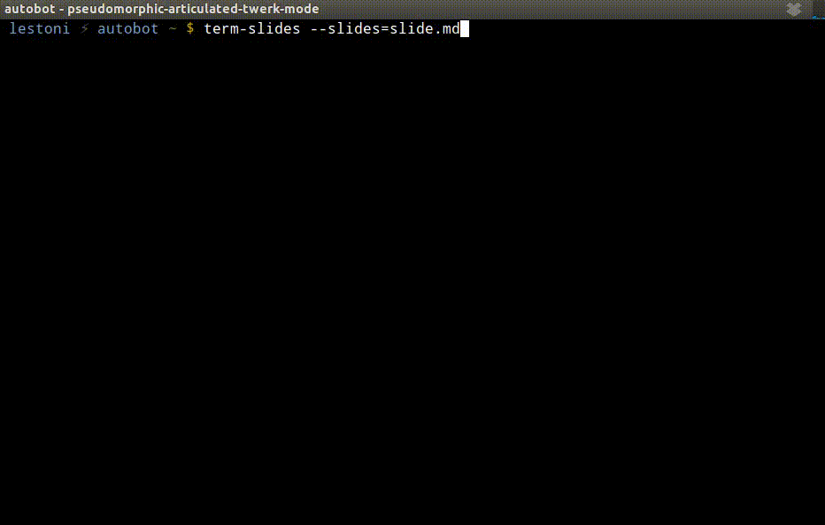

# term-slides

Run a presentation in the terminal with markdown written slides.

Separate sections using `---`. See example `slide.md`.



## Install.

```
$ npm install -g term-slides
```

## Usage.

```
$ term-slides --slides=slide1.md slide2.md slide3.md

```

Use key `q` or `CTRL+c` to quit presentation.


## License.

MIT.
